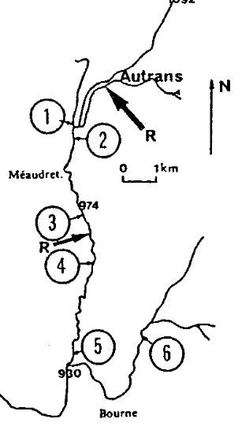
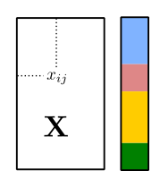
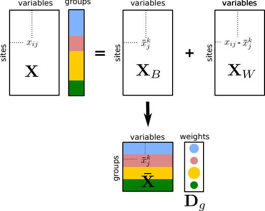
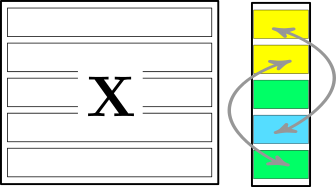
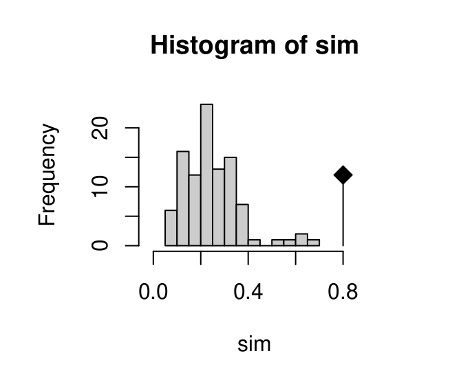
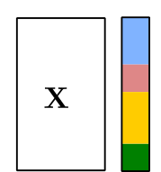
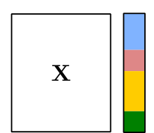

```{r setup, include=FALSE}
options(htmltools.dir.version = FALSE)
knitr::opts_chunk$set(tidy=TRUE, tidy.opts=list(width.cutoff=50), fig.height= 4, fig.width=4, dev='svg', fig.align="center", fig.path = "fig/")
```

```{r xaringan-themer, include=FALSE}
library(xaringanthemer)
duo(primary_color = "#1F4257", secondary_color = "#F97B64")
```

$$\newcommand{\tr}{\hspace{-0.05cm}^{\top}\hspace{-0.05cm}} % transpose d'une matrice$$

$$\newcommand{\mb}[1]{\mathbf{#1}}$$
$$\newcommand{\tripletM}[3]{\left ( #1, #2, #3 \right ) }$$

$$\newcommand{\sqnorm}[2]{
 \left \|  #1  \right \|^2_{#2}
}$$

$$\newcommand{\norm}[2]{
 \left \| #1 \right \|_{#2}
}$$


---
class:
# Introduction

```{r, include = FALSE}
adeg <- adegraphics::adegpar()
```

```{r 01intro, message = FALSE, size="tiny"}
library(ade4)
library(adegraphics)
adegpar(paxes.draw = TRUE,
  pbackground.col = 'lightgrey', pgrid.col = 'white')
data(meau)
str(meau, max.level = 1)
```
* Species table: abundance of 13 Ephemeroptera species recorded for 24 sites

* Environmental table: 10 physicochemical variables for the same sites

* Expermiental design (6 sites and 4 seasons)
---
# Introduction

.pull-left[
* Data table: 10 environmental variables measured for 24
samples (6 sites sampled each season) on the Méaudret
river
* Categorical variable(s): 6 sites or 4 seasons
* S1-S5 on the Méaudret, S6 is a control (on the Bourne river)

```{r}
head(meau$design)
```

]
.pull-right[
```{r, out.width="60%", echo = FALSE}

```
]
---
# Introduction
.pull-left[




* One table with *p* variables measured on *n* individuals
* One categorical variable partitioning the *n* individuals
in *g* groups (colors)
]
.pull-right[
Describe the information contained in the table:

* Identify differences between individuals **belonging to
different groups**
* Identify which variables best separate the groups
]

---
# Introduction
.pull-left[


* One table with *p* variables measured on *n* individuals
* One categorical variable partitioning the *n* individuals
in *g* groups (colors)
]
.pull-right[
Describe the information contained in the table:

* Identify differences between individuals **after removing
differences among groups**
* Identify relationships between variables
]

---
# Questions
.pull-left[
```{r}
pca_env <- dudi.pca(meau$env, scannf = FALSE)
biplot(pca_env, ppoints.col = 'blue', row.plabel.cex = 0, posieig = 'none')

```
]
--
.pull-right[
.center[
### Which structure is due to seasonal variation?
### Which part is not explained by seasonal variation?
]
]
---
# The univariate case 

.pull-left[
```{r, echo = FALSE, out.width="80%"}
boxplot(meau$env$Flow, ylim = c(0,500), col = "white", xlab = "", ylab = "Flow")
stripchart(meau$env$Flow, vertical = TRUE,
           pch = 21, add = TRUE, col = "black", bg = "grey")
```

Total variation

$$
\sigma^2 = \frac{1}{n}\sum_{i=1}^n{(x_i-\bar x)^2}
$$
]

---
# The univariate case 

.pull-left[
```{r, echo = FALSE, out.width="80%"}
boxplot(meau$env$Flow, ylim = c(0,500), col = "white", xlab = "", ylab = "Flow")
stripchart(meau$env$Flow, vertical = TRUE,
           pch = 21, add = TRUE, col = "black", bg = "grey")
```

Total variation

$$
\sigma^2 = \frac{1}{n}\sum_{i=1}^n{(x_i-\bar x)^2}
$$
]

.pull-right[
```{r, echo = FALSE, out.width="80%"}
boxplot(meau$env$Flow~meau$design$season, ylim = c(0,500), col = c("#80b3ff", "#de8787", "#008000", "#ffcc00"), xlab = "season", ylab = "Flow")
stripchart(meau$env$Flow ~ meau$design$season, vertical = TRUE,
           pch = 21, add = TRUE, col = "black", bg = "grey")
```

Within-group variation
$$\sigma_i^2 = \frac{1}{n_i}\sum_{j=1}^{n_i}{(x_j-\bar x_i)^2}$$
]
---
# The univariate case 

.pull-left[
```{r, echo = FALSE, out.width="80%"}
boxplot(meau$env$Flow, ylim = c(0,500), col = "white", xlab = "", ylab = "Flow")
stripchart(meau$env$Flow, vertical = TRUE,
           pch = 21, add = TRUE, col = "black", bg = "grey")
```

Total variation

$$
\sigma^2 = \frac{1}{n}\sum_{i=1}^n{(x_i-\bar x)^2}
$$
]

.pull-right[
```{r, echo = FALSE, out.width="80%"}
boxplot(meau$env$Flow~meau$design$season, ylim = c(0,500), col = c("#80b3ff", "#de8787", "#008000", "#ffcc00"), xlab = "season", ylab = "Flow")
stripchart(meau$env$Flow ~ meau$design$season, vertical = TRUE,
           pch = 21, add = TRUE, col = "black", bg = "grey")
```

Within-group variation

$$W= \sum_{i=1}^k{\frac{n_i}{n}\sigma_i^2}$$
]
---
# The univariate case 

.pull-left[
```{r, echo = FALSE, out.width="80%"}
boxplot(meau$env$Flow, ylim = c(0,500), col = "white", xlab = "", ylab = "Flow")
stripchart(meau$env$Flow, vertical = TRUE,
           pch = 21, add = TRUE, col = "black", bg = "grey")
```

Total variation

$$
\sigma^2 = \frac{1}{n}\sum_{i=1}^n{(x_i-\bar x)^2}
$$
]

.pull-right[
```{r, echo = FALSE, out.width="80%"}
boxplot(meau$env$Flow~meau$design$season, ylim = c(0,500),col='transparent', border = 'transparent',  xlab = "season", ylab = "Flow")
abline(h = tapply(meau$env$Flow, meau$design$season, mean), col = c("#80b3ff", "#de8787", "#008000", "#ffcc00"), lty = 3)
abline(h=mean(meau$env$Flow), lty=3, lwd = 2)
stripchart(meau$env$Flow ~ meau$design$season, vertical = TRUE,
           pch = 21, add = TRUE, col = "black", bg = "grey")
points(tapply(meau$env$Flow, meau$design$season, mean), cex = 3, bg = c("#80b3ff", "#de8787", "#008000", "#ffcc00"), pch = 21)

```

Between-group variation

$$
B = \sum_{i=1}^n{\frac{n_i}{n}(\bar x_i-\bar x)^2}
$$
]

---
# The univariate case
## the correlation ratio

We have

$$\sigma^{2}=\sum_{i=1}^k{\frac{n_{i}}{n}\sigma_{i}^2}+\sum_{i=1}^k{\frac{n_{i}}{n}(\bar x_{i} - \bar x)^2}$$
which corresponds to
$$
T =  W  +  B 
$$

The correlation ratio varies between 0 and 1 and is defined as 

$$
\eta^2 = \frac{B}{T}
$$
---
## The multivariate case
.pull-left[
.center[

]
]

.pull-right[
Total inertia measures the amount of variation in the data. 
$$I_{\tripletM{\mb{X}}{\mb{Q}}{\mb{D}}}   =  Trace(\mb{X}\tr\mb{D}\mb{X}\mb{Q})$$
<br>
For PCA, we have

$$I_{\tripletM{\mb{X}}{\mb{Q}}{\mb{D}}}  = \sum_{j = 1}^{p}{var(\mb{x}_j})$$
]

---
## ANOVA-like decomposition of a table

.pull-left[
```{r, echo = FALSE}

```
]

.pull-right[
The analysis of $\mb{X}$ leads to two additive components

* Between-Class Analysis focuses on the differences between groups $(\mb{X}_B)$
* Within-Class Analysis focuses on the differences between individuals while removing differences between groups $(\mb{X}_W)$
]
---

## Decomposition of total inertia

$$\begin{array}{rll}
I_{\tripletM{\mb{X}}{\mb{Q}}{\mb{D}}}  & = & Trace(\mb{X}\tr\mb{D}\mb{X}\mb{Q})\\
&= &Trace(\left (\mb{X}_B + \mb{X}_W\right )\tr\mb{D}\left (\mb{X}_B + \mb{X}_W \right )\mb{Q})\\
&= &  Trace(\mb{X}_B\tr\mb{D}\mb{X}_B\mb{Q}) +  Trace(\mb{X}_W\tr\mb{D}\mb{X}_W\mb{Q})
\end{array}$$

<br>

We obtain the following additive decomposition

$$I_{\tripletM{\mb{X}}{\mb{Q}}{\mb{D}}}=I_{\tripletM{\mb{X}_B}{\mb{Q}}{\mb{D}}}+I_{\tripletM{\mb{X}_W}{\mb{Q}}{\mb{D}}}$$
that translates into

$$
\textrm{Total Inertia}  = \textrm{Between-Class Inertia}  +  \textrm{Within-Class Inertia}
$$
<br>

--
Remember that the inertia is equal to the sum of eigenvalues of the associated analysis
---

## Removing an effect
### Within-Class Analysis

WCA is simply the analysis of the table centered per group $(\mb{X}_W)$. It is a partial analysis that focuses on the structure removing the effect of the categorical variables.

```{r, out.width="30%"}
wca.season <- wca(pca_env, meau$design$season, scannf = FALSE)
biplot(wca.season)
```


---

## Focusing on an effect
### Testing the significance

.center[ 
$R^2$ = Between-class inertia / Total inertia
]
.pull-left[
```{r, echo = FALSE}

```

.center[Permutation test]
]

.pull-right[

```{r, echo = FALSE, out.width="70%"}

```

]
---

## Two strategies

.pull-left[
```{r, echo = FALSE}

set.seed(24122006)
library(MASS)
s <- matrix(c(1, 0.8, 0.8, 1), 2)
x1 <- mvrnorm(50, c(0.3, -0.3), s)
x2 <- mvrnorm(50, c(-0.3, 0.3), s)
x <- rbind.data.frame(x1, x2)
x <-scalewt(x,scale=F)
fac <- factor(rep(1:2, rep(50, 2)))
w <- dudi.pca(x,scal=F,scannf=F)
wbet <- bca(w, fac, scannf=F)
wdis <- discrimin(w,fac,scannf=F)

f2 <- function(a,b) {
        z <- a*x[,1]+b*x[,2]
        a1 <- var(z)*99/100
        a2 <- var(predict(lm(z~fac)))*99/100
        a3 <- a2/a1
        round(c(a1,a2,a3),3)
}

s.class(scalewt(x,scale=F),fac,col=c("#80b3ff", "#de8787"), starSize = 0)
c1 <- 1; c2 <- 0; c3 <- f2(c1,c2)
art <- rbind(c(2*c1,2*c2))
lab1 <- "X"
c1 <- w$c1[1,1]; c2<- w$c1[2,1]; c3 <- f2(c1,c2)
art <- rbind(art, c(2*c1,2*c2))
lab2 <- "T"
c1 <- 0; c2 <- 1; c3 <- f2(c1,c2)
art <- rbind(art, c(2*c1,2*c2))
lab3 <- "Y"
c1 <- wbet$c1[1,1]; c2<- wbet$c1[2,1]; c3 <- f2(c1,c2)
art <- rbind(art, c(2*c1,2*c2))
lab4 <- "B"
provi <- wdis$fa/sqrt(sum(wdis$fa^2))
c1 <- provi[1,1]; c2 <- provi[2,1]; c3 <- f2(c1,c2)
art <- rbind(art, c(2*c1,2*c2))
lab5 <- "B/T"
labs <- c(lab1, lab2, lab3, lab4, lab5)
s.arrow(art, labels=labs, add=TRUE, pline.lwd=2)

```
]

.pull-right[
```{r, echo = FALSE}
f1 <- function(a,b,cha) {
    z <- a*x[,1]+b*x[,2]
    z0 <- seq(-4,4,le=50)
    z1 <- z[fac==1]
    z2 <- z[fac==2]
    hist(z, proba = TRUE, nclass = 10, col = grey(0.9),xlim=c(-4,4), main="")
    lines(z0,dnorm(z0,mean(z),sd(z)),lwd=2)
    lines(z0,0.5*dnorm(z0,mean(z1),sd(z1)),col="#80b3ff",lwd=2)
    lines(z0,0.5*dnorm(z0,mean(z2),sd(z2)),col="#de8787",lwd=2)
    mtext(side = 1, at = -3, line = -3, cha, cex = 1.5)
}
par(mfrow=c(3,2), mar = rep(0,4))
f1(1,0,"X")
f1(0,1,"Y")
f1(w$c1[1,1], w$c1[2,1], "T")
f1(wbet$c1[1,1], wbet$c1[2,1], "B")
provi <- wdis$fa/sqrt(sum(wdis$fa^2))
f1(provi[1,1], provi[2,1],"B/T")
```
]

* Principal component analysis maximizes T
* Between-class analysis maximizes B
* Discriminant analysis maximizes B/T
---
## Between-Class and Discriminant Analysis

.pull-left[
```{r, out.height="70%", echo = FALSE}

```

```{r, results='hide'}
discrimin(pca_env, meau$design$season, scannf = FALSE)
```

]

.pull-right[
```{r, out.height=="70%", echo = FALSE}

```

```{r, results='hide'}
bca(pca_env, meau$design$season, scannf = FALSE)
```

]

---
## Between-Class and Discriminant Analysis

.pull-left[
```{r, echo = FALSE}

set.seed(24122006)
library(MASS)
x <- cbind.data.frame(x = rnorm(100, mean = c(1, -1), sd = 0.6), y = rnorm(100, mean = c(-2, 2), sd = 3))
x <-scalewt(x,scale=F)
fac <- factor(rep(1:2, 50))
w <- dudi.pca(x,scal=F,scannf=F)
wbet <- bca(w, fac, scannf=F)
wdis <- discrimin(w,fac,scannf=F)

f2 <- function(a,b) {
        z <- a*x[,1]+b*x[,2]
        a1 <- var(z)*99/100
        a2 <- var(predict(lm(z~fac)))*99/100
        a3 <- a2/a1
        round(c(a1,a2,a3),3)
}

s.class(scalewt(x,scale=F),fac,col=c("#80b3ff", "#de8787"), starSize = 0)

c1 <- wbet$c1[1,1]; c2<- wbet$c1[2,1]; c3 <- f2(c1,c2)
art <- rbind(c(2*c1,2*c2))
lab4 <- "B"
provi <- wdis$fa/sqrt(sum(wdis$fa^2))
c1 <- provi[1,1]; c2 <- provi[2,1]; c3 <- f2(c1,c2)
art <- rbind(art, c(2*c1,2*c2))
lab5 <- "B/T"
labs <- c(lab4, lab5)
s.arrow(art, labels=labs, add=TRUE, pline.lwd=2)

```
]

.pull-right[
```{r, echo = FALSE}
f1 <- function(a,b,cha) {
    z <- a*x[,1]+b*x[,2]
    z0 <- seq(-10,10,le=50)
    z1 <- z[fac==1]
    z2 <- z[fac==2]
    hist(z, proba = TRUE, nclass = 10, col = grey(0.9),xlim=c(-10,10), main=cha)
    lines(z0,dnorm(z0,mean(z),sd(z)),lwd=2)
    lines(z0,0.5*dnorm(z0,mean(z1),sd(z1)),col="#80b3ff",lwd=2)
    lines(z0,0.5*dnorm(z0,mean(z2),sd(z2)),col="#de8787",lwd=2)
    
}
par(mfrow=c(2, 1), mar = c(2, 0, 3, 0))
f1(wbet$c1[1,1], wbet$c1[2,1], "B (Between-Class Analysis)")
provi <- wdis$fa/sqrt(sum(wdis$fa^2))
f1(provi[1,1], provi[2,1],"B/T (Discriminant Analysis)")
```
]

---
## Spurious groups

BCA of random data with a moderate number of variables

```{r, echo = FALSE}
fac <- gl(5,10)
X <- data.frame(matrix(rnorm(500), 50))
s.class(bca(dudi.pca(X, scan = F), fac, scan=F)$ls, fac, col = TRUE, star = 0, ell = 0, chull=1, main = "50 ind x 10 var")
```

---
## Spurious groups

BCA of random data with a high number of variables

```{r, echo = FALSE}
fac <- gl(5,10)
X <- data.frame(matrix(rnorm(5000), 50))
bca.spurious <- bca(dudi.pca(X, scan = F), fac, scan=F)
s.class(bca.spurious$ls, fac, col = TRUE, star = 0, ell = 0, chull=1, main = "50 ind x 100 var")
```

---
## Spurious groups

* Perform permutation test even if segregation of groups is clear on the factorial map
* Cross-validation to display results

```{r, out.width="40%"}
s.class(loocv(bca.spurious)$XValCoord, fac, col = TRUE, star = 0, ell = 0, chull=1, main = "50 ind x 100 var CV")
```

```{r, include = FALSE}
adegpar(adeg)
```
