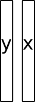

```{r setup, include=FALSE}
options(htmltools.dir.version = FALSE)
knitr::opts_chunk$set(tidy=TRUE, tidy.opts=list(width.cutoff=50), fig.height= 4, fig.width=4, dev='svg', fig.align="center", fig.path = "fig/")
```

```{r xaringan-themer, include=FALSE}
library(xaringanthemer)
duo(primary_color = "#1F4257", secondary_color = "#F97B64")
```

$$\newcommand{\tr}{\hspace{-0.05cm}^{\top}\hspace{-0.05cm}} % transpose d'une matrice$$

$$\newcommand{\mb}[1]{\mathbf{#1}}$$

$$\newcommand{\sqnorm}[2]{
 \left \|  #1  \right \|^2_{#2}
}$$

$$\newcommand{\norm}[2]{
 \left \| #1 \right \|_{#2}
}$$


---
class:
# Introduction

```{r, include = FALSE}
library(ade4)
library(adegraphics)
adeg <- adegpar()
```

```{r 01intro, message = FALSE, size="tiny"}
library(ade4)
library(adegraphics)
adegpar(paxes.draw = TRUE,
  pbackground.col = 'lightgrey', pgrid.col = 'white')
data(doubs)
str(doubs, max.level = 1)
```
* Species table: abundance of 27 fish species recorded for 30 sites on the Doubs river

* Environmental table: 11 environmental variables for the same sites

* Spatial coordinates
---
# Introduction
.pull-left[


One table with *p* variables measured on *n* individuals

* quantitative (`dudi.pca`)
* categorical (`dudi.coa` or `dudi.acm`)
* both (`dudi.mix` or `dudi.hillsmith`)
]
.pull-right[
Describe the information contained in the table:

* Identify which variables are the most linked

* Identify the differences/similarities between individuals
]

---
```{r 01acp, tidy.opts=list(width.cutoff=50), out.width = "60%"}
pca_fish <- dudi.pca(doubs$fish, scale = FALSE, scannf = FALSE)
biplot(pca_fish, ppoints.col = 'blue', row.plabel.cex = 0, posieig = 'none')
```

---
```{r 03acp, tidy.opts=list(width.cutoff=50), fig.width = 6, fig.height = 6, out.width="70%"}
s.value(doubs$xy, doubs$fish[,1:16], centerpar = TRUE, symbol = "circle", plegend.drawKey = FALSE, paxes.draw = FALSE)
```

---
```{r 02acp, tidy.opts=list(width.cutoff=45), fig.width = 6, fig.height = 3, out.width="70%"}
s.value(doubs$xy, pca_fish$li, symbol = "circle", paxes.draw = FALSE)
```
--
.center[
### Which factors can explain these structures?
]
---
# Two tables

.pull-left[


One table with *p* variables measured on *n* individuals

One table with *m* variables measured on the same individuals

]
.pull-right[
Identify what is the information common to both tables:

* Identify which variables are the most linked

* Identify how this link varies for individuals

]

--

.center[

## But how?

]
---
## Indirect ordination

.pull-left[
.center[


Summarize by a simple ordination method

```{r ,ref.label="01acp", echo=FALSE, out.width = "50%"}

```

]
]

--

.pull-right[
.center[


and interpret the structures with the second table using simple tools
]

* Graphical interpretation
* Correlation
* Regression
]

---

.pull-left[
### Graphics

```{r tidy.opts=list(width.cutoff=20), out.width = "90%", fig.align = "center"}
s.value(pca_fish$li, scale(doubs$env$dfs))
```

]

.pull-right[
### Correlation

```{r tidy.opts=list(width.cutoff=20), out.width = "90%", fig.height = 3, fig.align="center"}
s1d.curve(pca_fish$li, p1.horizontal = FALSE, at = doubs$env$dfs)
cor(pca_fish$li, doubs$env$dfs)
```
]

---
.pull-left[
### Correlation

```{r tidy.opts=list(width.cutoff=20)}
s.corcircle(cor(doubs$env, pca_fish$li))
```
]
.pull-right[
### Regression
```{r tidy.opts=list(width.cutoff=20)}
lm1 <- lm(as.matrix(pca_fish$li)~as.matrix(doubs$env))
s.arrow(coefficients(lm1)[-1, ], labels = names(doubs$env))
```
]

---
## Analysis of the concanated table
.center[
.pull-left[


Concatenation
]

.pull-right[


Simple ordination
]
]

---
```{r, out.height= "70%"}
conc <- cbind(doubs$fish, doubs$env)
biplot(dudi.pca(conc, scannf = FALSE), col.plabel.col = rep(c(2, 4), c(27, 11)))
```

---
## From two variables to two tables
.pull-left[
.center[



]
]

.pull-right[
* Canonical Correlation Analysis (correlation)

* Co-Inertia Analysis (covariance)

* Analysis on instrumental variables (regression)
]

---
## Linear combinations

### PCA
Find a vector of coefficients $\mb{a} = [a_1, \cdots , a_p]\tr$ maximizing $\sqnorm{\mb{XQa}}{\mb{D}}$ with $\norm{\mb{a}}{\mb{Q}} = 1$

### Linear regression
Find a vector of coefficients $\mb{a} = [a_1, \cdots , a_p]\tr$ maximizing $\sqnorm{\mb{Xay}}{\mb{D}}$

### Two-table methods
Define two vectors of coefficients $\mb{a}$ and $\mb{b}$ to build two linear combinations $\mb{XQa}$ and $\mb{YMb}$
---
## Canonical correlation analysis
.pull-left[
.center[

]
]
* function `stats:cancor`
* maximization of $cor(\mathbf{Xa}, \mathbf{Yb})$
---
## Co-inertia analysis
.pull-left[
.center[

]
]
.pull-right[
* function `ade4::coinertia`
* maximization of $cov(\mathbf{XQa}, \mathbf{YMb})$
]

A compromise between canonical correlation analysis, and the two PCAs:

$$cov(\mathbf{XQa}, \mathbf{YMb}) = cor(\mathbf{XQa}, \mathbf{YMb}) \cdot \norm{\mb{XQa}}{\mb{D}} \cdot \norm{\mb{YMb}}{\mb{D}}$$

---
```{r, fig.width = 5, fig.height=5}
pca_env <- dudi.pca(doubs$env, scannf = FALSE)
coi <- coinertia(pca_fish, pca_env, scannf = FALSE)
plot(coi)
```

---
```{r, fig.width = 2, fig.height=2}
rt.coi <- randtest(coi)
plot(rt.coi)
```

Try `summary(coi)`
---
## Analysis on instrumental variables
.pull-left[
.center[

]
]
.pull-right[

* function `ade4::pcaiv`
* maximization of $\sqnorm{\widehat{\mb{Y}}\mb{Q}\mb{a}}{\mb{D}}$
]

This framework encompasses:

* Redundancy Analysis (RDA)

* Canonical Correspondence Analysis (CCA)

In practice, it corresponds to the PCA (for RDA) or CA (for CCA) of the predicted table $\widehat{\mb{Y}}$ containing the prediction of the linear models of $\mb{Y}$ by $\mb{X}$.

In vegan, use functions `rda` and `cca` with a formula interface.

---
```{r, fig.width = 5, fig.height=5}
rda1 <- pcaiv(pca_fish, doubs$env, scannf = FALSE)
plot(rda1)
```

---
```{r, fig.width = 2, fig.height=2}
rt.rda <- randtest(rda1)
plot(rt.rda)
```

Try `summary(rda1)`

When a PCA is applied on the response table, the method is called Redundancy Analysis

Try to apply a correspondence analysis (`dudi.coa`) instead of a PCA on `doubs$fish`. You obtain Canonical Correspondence Analysis.
---

## Partial analyses

In some circumstances, it is useful to remove an effect corresponding to covariables (e.g., sampling constraints) to identify structures that are independent to this effect. 

Partial analysis is implemented in function `orthopcaiv` which focuses on the analysis of residual table $\mb{E} = \mb{Y} - \widehat{\mb{Y}}$.

In vegan, this is implemented by `Condition()` in the formula framework.

---

## Variation partitioning


.center[
```{r, echo = FALSE, out.width ="50%"}

```

]


When multiple sets of explanatory variables are considered, variation partitioning can be applied to identify their additive contribution to the structuring of the response table (see `varipart` or more complete `vegan::varpart`).


.center[

```{r, echo = FALSE, out.width ="40%"}

```


]

---

## One particular case
.pull-left[
.center[

]
]

.pull-right[
The second table contains only one categorical variable

The aim is to maximize the separation between the groups

]
* `cancor`-like method is Discriminant Analysis (`ade4::discrimin`)

* `pcaiv`-like method is Between-Class Analaysis (`ade4::bca`)

```{r, include = FALSE}
adegpar(adeg)
```
