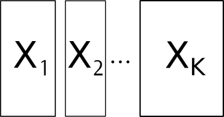

```{r setup, include=FALSE}
options(htmltools.dir.version = FALSE)
knitr::opts_chunk$set(tidy=TRUE, tidy.opts=list(width.cutoff=50), fig.height= 4, fig.width=4, dev='svg', fig.align="center", fig.path = "fig/")
```

```{r xaringan-themer, include=FALSE}
library(xaringanthemer)
duo(primary_color = "#1F4257", secondary_color = "#F97B64")
```

$$\newcommand{\tr}{\hspace{-0.05cm}^{\top}\hspace{-0.05cm}} % transpose d'une matrice$$

$$\newcommand{\mb}[1]{\mathbf{#1}}$$

$$\newcommand{\sqnorm}[2]{
 \left \|  #1  \right \|^2_{#2}
}$$

$$\newcommand{\norm}[2]{
 \left \| #1 \right \|_{#2}
}$$


---
# Introduction

We consider situations involving the analysis of multiple tables. This data structure encompasses the following cases: 

.column-left[
.center[

]
*K* tables with different variables measured on the same *n* individuals
]
.column-center[
.center[

]
*K* tables with the same *p* variables measured on different individuals
]
.column-right[
.center[

]
*K* tables with the same *p* variables measured on the same *n* individuals
]

---

## Example: `jv73`

.pull-left[
* Measurements of 12 physico-chemical variables for 92 sites

* The sites belong to 12 rivers

]

.pull-right[
.center[]
]

**Is the typology of variables (physico-chemical gradients) similar in all rivers?**

---

## Example: `friday87`

.pull-left[
* Abundance of 91 macro-invertebrate species sampled 16 ponds

* The species are grouped in 10 taxonomic groups (Hemiptera, Trichoptera, ...)


]

.pull-right[
.center[]
]

**Is the typology of sites (similarities in community composition) identical for all taxonomic groups?**

---


## Example: `meaudret`

.pull-left[
* Measurements of 10 physico-chemical variables for 5 sites

* Each table corresponds to a date (season)

]

.pull-right[
.center[]
]

**Is the typology of sites (similarities in physico-chemical aspects) identical for all dates?**

**Are the temporal patterns (similarities in physico-chemical aspects) identical for all sites?**

---


## Example: `bf88`

.pull-left[
* Abundance of 70 bird species in 4 regions

* Each table corresponds to a vegetation stage along a gradient of 6 (open → closed habitat)


]

.pull-right[
.center[]
]

**Is the typology of vegetation stages (community composition) identical for all regions?**

**Are the regional differences in community composition identical for all stages?**


---


# K-table methods

Simultaneous analysis of several tables preserving the multiblock design of the data. It allows to:

* Identify a common structure to all tables (blocks)
* Identify similarities/differences between tables

  $\rightarrow$ based on the common dimension (either variables or individuals)

* Identify which variables are involved in the structures
* Identify which individuals are involved in the structures

---

## General principles

* (Step 0: Define cross-product matrices to obtain matrices with same dimensions)  

* Step 1: Define an "average table"  (common table for MFA)

* Step 2: Analysis of this table to describe the common structure 

* Step 3: Project each table and its rows and columns on the common structure

---

## Different alternatives

* **Partial Triadic Analysis** is restrictred to data cubes where all tables
have the same individuals and variables

* **Multiple Factor Analysis** is restricted to K-tables with at least the
same individuals

* **Multiple Co-Inertia Analysis** is restricted to K-tables with
at least the same individuals

* **STATIS** allows to deal with K-tables with at least the
same individuals (STATIS on WD) or at least the same variables (STATIS
on VQ)

---

# STATIS 

This method is very flexible and allows to deal with the three different types of K-tables. It consists in 3 main steps:

* **The interstructure** is the analysis of the relations between the individual data sets
* **The compromise** consists in deriving an optimal set of weights from the interstructure to compute the best common representation of the data sets. This consists in performing the PCA of a consensus table 
* **The intrastructure** consists in studying the variation of the different data sets relative to the compromise structure
---

## RV coefficient

It measures the link between two tables. It varies between 0 and 1. If the tables have the same rows, we have:

$$RV(\mb{X}_k,\mb{X}_l)=\frac{COVV(\mb{X}_k,\mb{X}_l)}{\sqrt{VAV(\mb{X}_k)}\sqrt{VAV(\mb{X}_l)}}$$
where the vectorial covariance is 

$$COVV(\mb{X}_k,\mb{X}_l) = Trace(\mb{X}_k\mb{Q}_k \mb{X}_k\tr \mb{D} \mb{X}_l \mb{Q}_l\mb{X}_l\tr \mb{D})=Trace(\mb{W}_k\mb{D} \mb{W}_l \mb{D})$$
and the vectorial variance is 

$$VAV(\mb{X}_k) = Trace(\mb{X}_k\mb{Q}_k \mb{X}_k\tr \mb{D} \mb{X}_k \mb{Q}_k\mb{X}_k\tr \mb{D})= Trace(\mb{W}_k\mb{D} \mb{W}_k \mb{D})$$

---

## The interstructure

It consists in the diagonalization of the $K \times K$ matrix of RV coefficients

```{r, echo = FALSE, message=FALSE}
library(ade4)
library(adegraphics)
data(friday87)
w1 <- data.frame(scalewt(friday87$fau, scale = FALSE))
kta1 <- ktab.data.frame(w1, friday87$fau.blo,
    tabnames = friday87$tab.names)
statis1 <- statis(kta1, scannf = FALSE)
bc2 <- plotEig(statis1$RV.eig, yax = 1, nf = 1, pbackground.box = TRUE,
    psub = list(text = "Eigenvalues", cex=2) , plot = FALSE)
cs2 <- s.corcircle(statis1$RV.coo, pbackground.box = FALSE, plot = FALSE)
ADEgS(list(cs2, bc2), rbind(c(0, 0, 1, 1), c(0, 0.55, 0.45, 1)))
```


---

## The compromise

Let $\mb{\alpha}\tr=(\alpha_1 \, \dots \, \alpha_k \, \dots \, \alpha_K)$ be the first eigenvector of the Interstructure. The Compromise is defined as

$$\sum_{k=1}^K \alpha_k \frac{\mb{W}_k\mb{D}}{\sqrt{VAV(\mb{X}_k)}}$$

Let $\mb{\Lambda}$ and $\mb{U}$ be the eigenvalues and the eigenvectors of $\mb{WD}$ ( $\mb{U}\tr \mb{DU}=\mb{I}$ ). The coordinates of individuals on the compromise are given by $\mb{L}=\mb{WDU}\mb{\Lambda}^{\frac{1}{2}}$. 

```{r, echo = FALSE, out.width="35%"}
bcC <- plotEig(statis1$C.eig, yax = 2, nf = 2, pbackground.box = TRUE,
    psub = list(text = "Eigenvalues", cex = 2), plot = FALSE)
slC <- s.label(statis1$C.li, plabels.cex = 1.5, plabels.optim = TRUE,
    plot = FALSE)
ADEgS(list(slC, bcC), rbind(c(0, 0, 1, 1), c(0.8, 0, 1, 0.2)))
```

---

## The intrastructure

* Variables of each table $\mb{X}_k$ are represented by the scores $\mb{C}_k= \mb{X}_k\tr \mb{DU}$.\\
* Individuals of each table are repesented by $\mb{L}_k=\mb{W}_k \mb{DU}\mb{\Lambda}^{\frac{1}{2}}$.  


```{r, echo = FALSE}
kplot(statis1, plabels.cex = 2, psub.cex = 2, pgrid.text.cex = 2)
```

