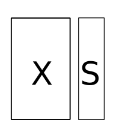

```{r setup, include=FALSE}
options(htmltools.dir.version = FALSE)
knitr::opts_chunk$set(tidy=TRUE, tidy.opts=list(width.cutoff=50), fig.height= 4, fig.width=4, dev='svg', fig.align="center", fig.path = "fig/")
```

```{r xaringan-themer, include=FALSE}
library(xaringanthemer)
duo(primary_color = "#1F4257", secondary_color = "#F97B64")
```

$$\newcommand{\tr}{\hspace{-0.05cm}^{\top}\hspace{-0.05cm}} % transpose d'une matrice$$

$$\newcommand{\mb}[1]{\mathbf{#1}}$$

$$\newcommand{\sqnorm}[2]{
 \left \|  #1  \right \|^2_{#2}
}$$

$$\newcommand{\norm}[2]{
 \left \| #1 \right \|_{#2}
}$$


---
class:
# Introduction
```{r 01intro, message = FALSE, size="tiny"}
library(ade4)
library(adegraphics)
adegpar(background.col = 'lightgrey')
data(mafragh)
names(mafragh)
```
* Species table (`flo`): abundance indexes of 56 plant species recorded for 97 sites in the Mafragh plain (Algeria)

* Spatial coordinates for the sites (`xy`)
---
# Introduction
.pull-left[
.center[

]


One table with *p* variables measured on *n* individuals

* quantitative (`dudi.pca`)
* categorical (`dudi.coa` or `dudi.acm`)
* both (`dudi.mix` or `dudi.hillsmith`)
]
.pull-right[
Describe the information contained in the table:

* Identify which variables are the most linked

* Identify the differences/similarities between individuals
]

---
```{r 01acp, tidy.opts=list(width.cutoff=50), out.width = "50%"}
pca_veg <- dudi.pca(mafragh$flo, scale = FALSE, scannf = FALSE)
biplot(pca_veg, ppoints.col = 'blue', row.plabel.cex = 0, posieig = 'none')
```

--
.center[
### Is community composition spatially structured?
]

---
## One table and spatial information

.pull-left[




One table with *p* variables measured on *n* individuals

One table with spatial coordinates for the same *n* individuals

]
.pull-right[
* Identify spatial patterns
* Identify which variables are spatially structred
* Identify at which scales these spatial patterns occur

]

--

.center[

**But how?**

]

---
# Indirect approaches

.pull-left[
.center[


Summarize by a simple ordination method

```{r ,ref.label="01acp", echo=FALSE, out.width = "50%"}

```

]
]

--

.pull-right[

and detect spatial structures using simple tools

* Mapping
* Regression on spatial predictors (polynomials, MEM)
* Spatial autocorrelation 
]

---

## Spatial mapping

```{r tidy.opts=list(width.cutoff=20), fig.dim= c(6,3), out.width = "90%", fig.align = "center"}
s.value(mafragh$xy, pca_veg$li)
```

---

## Correlation with spatial predictors

```{r tidy.opts=list(width.cutoff=20), out.width = "45%", fig.height = 3, fig.align="center"}
poly.xy <- poly(as.matrix(mafragh$xy), degree = 2)
s.value(mafragh$xy, poly.xy)
cor(pca_veg$li, poly.xy)
```

---

# Introducing spatial information in multivariate methods

.pull-left[
Need of direct and explicit spatial multivariate methods
.center[

]
]

.pull-right[
Spatial information :

* **symmetric** ( $n \times n$ )
  * Distances matrix
  * Spatial weighting matrix
  
* **raw data** ( $n \times p$ )
  * (Polynomials of) Geographic coordinates
  * Spatial eigenvectors (MEM)
]

---
## Space as distances

.pull-left[
* Compute spatial distances $\mb{D_S}$
* Compute faunistic distances $\mb{D_X}$
* Study their link

```{r}
dx <- dist(mafragh$flo)
ds <- dist(mafragh$xy)
plot(dx~ds)
```

]

.pull-right[
```{r}

mantel.randtest(dx, ds)
```

]

---
## Spatial Weighting Matrix

.pull-left[

$$ \mb{W}=[w_{ij}] $$


$$w_{ij} = 1 \textrm{ if sites } i \textrm{ and } j \textrm{ are neighbors}$$ 
$$w_{ij} = 0 \textrm{ otherwise}$$

Options:

* Non-binary weights
* Standardization 

]

.pull-right[
```{r, echo = FALSE}
s.label(mafragh$xy, nb = mafragh$nb, plabel.cex = 0)
```

]

---

# Spatial autocorrelation

Moran's index

$$MC(\mathbf{x}) = \frac{n\sum\nolimits_{\left( 2 \right)} {w_{ij} (x_i -\bar 
{x})(x_j -\bar {x})} }{\sum\nolimits_{\left( 2 \right)} {w_{ij} } 
\sum\nolimits_{i = 1}^n {(x_i -\bar {x})^2} }\mbox{ where 
}\sum\nolimits_{\left( 2 \right)} =\sum\limits_{i = 1}^n {\sum\limits_{j = 1}^n 
} \mbox{ with }i\ne j$$

In matrix notation

$$MC(\mathbf{x}) = \frac{n}{\mathbf{1}\tr\mathbf{W1}}\frac{\mathbf{z}\tr{\mathbf{Wz}}}{\mathbf{z}\tr\mathbf{z}}$$
where $\mb{z} = \mb{x} - \bar{x}$ . With row-standardization 

$$MC(\mathbf{x}) = \frac{\mathbf{z}\tr{\mathbf{\tilde{z}}}}{\mathbf{z}\tr\mathbf{z}}$$
It is a measure of the link between the original variable ( $\mb{z}$ ) and its lagged version ( $\tilde{\mb{z}}$ )
---
## Moran's index and scatterplot

.pull-left[
```{r, message=FALSE, out.width="70%"}
library(adespatial)
library(spdep)
s.value(mafragh$xy, pca_veg$li[,1])
```

]

.pull-right[
```{r}
moran.randtest(pca_veg$li[,1], nb2listw(mafragh$nb))

```

]

---
## Moran's index and scatterplot

.pull-left[
```{r, message=FALSE, out.width="70%"}
moran.plot(pca_veg$li[,1], nb2listw(mafragh$nb))
```

]

.pull-right[
```{r}
moran.randtest(pca_veg$li[,1], nb2listw(mafragh$nb))

```

]

---

## Moran's Eigenvector Maps
.pull-left[

* Eigenvectors of the doubly-centred spatial weighting matrix

* Orthogonal vectors maximizing the spatial autocorrelation

* They can be used as spatial predictors in correlation or regression models (e.g., scalogram)

```{r, echo = FALSE, out.width="60%"}
s.value(mafragh$xy, pca_veg$li[,1], main = "PCA axis 1")
```

]

.pull-right[

```{r, echo = FALSE, out.width="70%"}
me <- mem(nb2listw(mafragh$nb))
s.value(mafragh$xy, me[, c(1,2, 10, 40)], plegend.drawKey = FALSE)
```

```{r, echo = FALSE, out.width="70%", fig.width = 6, fig.height=4}
sc1 <- scalogram(pca_veg$li[,1], me)
plot(sc1)
```
]

---

# Spatial multivariate methods

* **MULTISPATI** integrates a spatial weighting matrix in standard multivariate methods. It identifies spatial structures instead of structures. 
* **MEM-based models** introduces spatial predictors in correlation or regression-based approaches (e.g., redundancy analysis, variation partitioning) 
---

## Multispati
.pull-left[
.center[
```{r, echo=FALSE, out.height="150px"}
knitr::include_graphics("img/onetable.png", dpi=NA)
```
]
]
.pull-right[
```{r, echo = FALSE, fig.height=2, fig.width=2, out.height="150px"}
s.label(mafragh$xy, nb = mafragh$nb, plabel.cex = 0)
```
]

This analysis maximizes the product 

$$MC_\mathbf{D}(\mathbf{XQa}) \cdot \sqnorm{\mathbf{X}\mathbf{Q}\mathbf{a}}{\mathbf{D}}$$
and thus finds a linear combination of variables maximizing a compromise between:

* the criteria optmized in the standard analysis ( $\sqnorm{\mathbf{X}\mathbf{Q}\mathbf{a}}{\mathbf{D}}$ ) 

* spatial autocorrelation ( $MC_\mathbf{D}(\mathbf{XQa})$ )

It corresponds to a coinertia analysis between the original table $\mb{X}$ and its lagged version $\tilde{\mb{X}}=\mb{WX}$.
---

## Multispati
```{r}
ms1 <- multispati(pca_veg, nb2listw(mafragh$nb), scannf = FALSE, nfposi = 2, nfnega = 0)
summary(ms1)
```
---

.pull-left[
```{r, out.width="70%"}
s.label(ms1$li)
```
<br>
<br>
<br>

maximization of the product of variance and Moran's I
]
.pull-right[
```{r, out.width="70%", fig.width = 6, fig.height=3}
s.value(mafragh$xy, ms1$li, nb = mafragh$nb)

```

```{r, out.width="70%"}
s.arrow(ms1$c1)
```

]

---

## MEM-based models

.pull-left[
.center[
```{r, echo=FALSE, out.height="150px"}
knitr::include_graphics("img/Xspat2.png", dpi=NA)
```
]
]
.pull-right[
```{r, echo = FALSE, fig.height=2, fig.width=6, out.height="150px"}
s.value(mafragh$xy, me[, c(1,2, 40)], plegend.drawKey = FALSE)
```
]

Spatial eigenvectors can be used as predictors in regression models (e.g., redundancy analysis)

* As there is a high number of predictors, variable selection should be preformed prior to the analysis

* When other predictors are considered, variation partitioning can be used. This approach based on combination of several RDA models allows to evaluate the relative contribution of spatial and other predictors to explain the response table (variation partitioning).

* see [adespatial tutorial](https://cran.r-project.org/web/packages/adespatial/vignettes/tutorial.html) for more details

