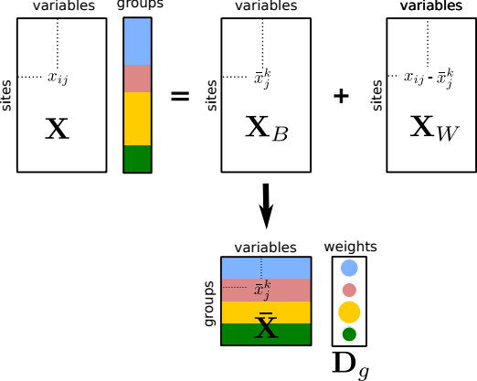

```{r setup, include=FALSE}
options(htmltools.dir.version = FALSE, width = 72)
knitr::opts_chunk$set(tidy=TRUE, tidy.opts=list(width.cutoff=50), fig.height= 4, fig.width=4, dev='svg', fig.align="center", fig.path = "fig/")
```

```{r xaringan-themer, include=FALSE}
library(xaringanthemer)
duo(primary_color = "#1F4257", secondary_color = "#F97B64")
```

```{r include = FALSE}
library(knitr)
hook_output <- knit_hooks$get("output")
knit_hooks$set(output = function(x, options) {
  lines <- options$output.lines
  if (is.null(lines)) {
    return(hook_output(x, options))  # pass to default hook
  }
  x <- unlist(strsplit(x, "\n"))
  more <- "..."
  if (length(lines)==1) {        # first n lines
    if (length(x) > lines) {
      # truncate the output, but add ....
      x <- c(head(x, lines), more)
    }
  } else {
    x <- c(more, x[lines], more)
  }
  # paste these lines together
  x <- paste(c(x, ""), collapse = "\n")
  hook_output(x, options)
})
``` 
$$\newcommand{\tr}{\hspace{-0.05cm}^{\top}\hspace{-0.05cm}} % transpose d'une matrice$$

$$\newcommand{\mb}[1]{\mathbf{#1}}$$

$$\newcommand{\sqnorm}[2]{
 \left \|  #1  \right \|^2_{#2}
}$$

$$\newcommand{\norm}[2]{
 \left \| #1 \right \|_{#2}
}$$


---
## Strategies of decomposition

```{r, echo = FALSE, out.width="50%"}

```

* Within-class analysis focuses on $\mb{X}_W$
* Between-class analysis focuses on $\mb{X}_B$ maximizing $B$
* Discriminant analysis focuses on $\mb{X}_B$ maximizing $B/T$

---
## Within-Class Analysis

---
## Perform the analysis

```{r message = FALSE}
library(ade4)
library(adegraphics)
data(meau)
pca_env <- dudi.pca(meau$env, scannf = FALSE)
wca.season <- wca(pca_env, meau$design$season, scannf = FALSE) #<<
```

---
## Have a look to the summary
```{r, output.lines = 15}
summary(wca.season)
```
---
## Plot the results

```{r, fig.width = 3.5, fig.height=3.5}
g1 <- plot(wca.season)
names(g1)
```
---
## Loadings for variables

```{r, fig.width=3, fig.height=3}
g1$loadings
```

  $\mb{A}$: coefficients (loadings) for the variables of $\mb{X}_W$ (`wca.season$c1`)
---
## Scores for individuals

.pull-left[
```{r, fig.width = 3.5, fig.height=3.5}
g1$ccrow
```

$\mathbf{X}_W\mb{QA}$: scores of individuals (`wca.season$li`)
]

.pull-right[
```{r, fig.width = 3.5, fig.height=3.5}
g1$row
```

$\mathbf{X}\mb{QA}$: projections of individuals (`wca.season$ls`)

]
---
## Between-Class Analysis

## Perform the analysis

```{r message = FALSE}
bca.season <- bca(pca_env, meau$design$season, scannf = FALSE)#<<
```

---

## Test the significance of the link
.pull-left[
```{r, fig.width = 3, fig.height=3}
rt.bca <- randtest(bca.season)
plot(rt.bca)
```
]
.pull-right[
```{r}
rt.bca
```
]

---
## Have a look to the summary
```{r, output.lines = 15}
summary(bca.season)
```
---
## Plot the results

```{r, fig.width = 3.5, fig.height=3.5}
g1 <- plot(bca.season)
names(g1)
```
---
## Loadings for variables

```{r, fig.width=3, fig.height=3}
g1$loadings
```

  $\mb{A}$: coefficients (loadings) for the variables of $\mb{X}_B$ (`bca.season$c1`)
---
## Scores for individuals and classes

.pull-left[
```{r, fig.width = 3.5, fig.height=3.5}
g1$class
```

$\mathbf{X}_B\mb{QA}$: scores of classes (`bca.season$li`)
]

.pull-right[
```{r, fig.width = 3.5, fig.height=3.5}
g1$row
```

$\mathbf{X}\mb{QA}$: projections of individuals (`bca.season$ls`)

]

---
## Cross-validation

```{r}
xval <- loocv(bca.season)
s.class(xval$XValCoord, meau$design$season, col = TRUE, star = 0, ell = 0, chull=1)
```

---
## Discriminant Analysis


## Perform the analysis

```{r message = FALSE}
dis.season <- discrimin(pca_env, meau$design$season, scannf = FALSE)#<<
```

---

## Test the significance of the link
.pull-left[
```{r, fig.width = 3, fig.height=3}
rt.dis <- randtest(dis.season)
plot(rt.dis)
```
]
.pull-right[
```{r}
rt.dis
```
]

---
## Plot the results

```{r, fig.width = 3.5, fig.height=3.5}
g1 <- plot(dis.season)
names(g1)
```
---
## Loadings for variables

```{r, fig.width=3, fig.height=3}
g1$loadings
```

  $\mb{A}^*$: coefficients (loadings) for the variables of $\mb{X}_B$ (`dis.season$fa`) with the constraint that $\sqnorm{\mb{XA}^*}{\mb{D}} = 1$
---
## Scores for individuals and classes

.pull-left[
```{r, fig.width = 3.5, fig.height=3.5}
g1$class
```

$\mathbf{X}_B\mb{A}^*$: scores of classes (`dis.season$gc`)
]

.pull-right[
```{r, fig.width = 3.5, fig.height=3.5}
g1$row
```

$\mathbf{X}\mb{A}^*$: scores of individuals (`dis.season$li`)

]

---

## Your turn
1. Create a Rmd or a R file
2. Create two tables or random numbers (`rnorm`) with 50 individuals and either 10 or 200 variables
3. Create a factor separating the individuals in 5 groups of 10 individuals (`gl`)
4. Perform the between-class analyses of the two tables
5. Look at the outputs and compare the results
6. Display cross-validated maps
7. Interpret
---
