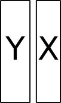
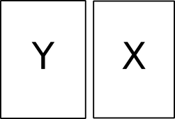
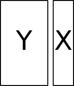
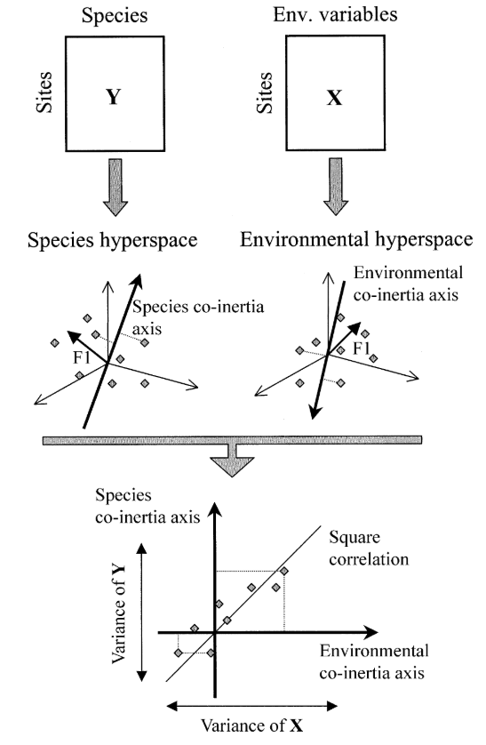
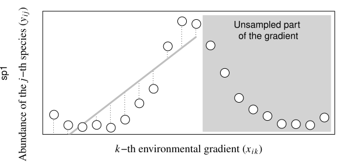
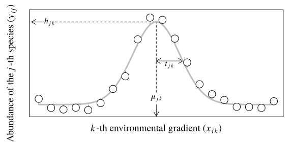

```{r setup, include=FALSE}
options(htmltools.dir.version = FALSE, width = 72)
knitr::opts_chunk$set(tidy=TRUE, tidy.opts=list(width.cutoff=50), fig.height= 4, fig.width=4, dev='svg', fig.align="center", fig.path = "fig/")
```

```{r xaringan-themer, include=FALSE}
library(xaringanthemer)
duo(primary_color = "#1F4257", secondary_color = "#F97B64")
```

```{r include = FALSE}
library(knitr)
hook_output <- knit_hooks$get("output")
knit_hooks$set(output = function(x, options) {
  lines <- options$output.lines
  if (is.null(lines)) {
    return(hook_output(x, options))  # pass to default hook
  }
  x <- unlist(strsplit(x, "\n"))
  more <- "..."
  if (length(lines)==1) {        # first n lines
    if (length(x) > lines) {
      # truncate the output, but add ....
      x <- c(head(x, lines), more)
    }
  } else {
    x <- c(more, x[lines], more)
  }
  # paste these lines together
  x <- paste(c(x, ""), collapse = "\n")
  hook_output(x, options)
})
``` 
$$\newcommand{\tr}{\hspace{-0.05cm}^{\top}\hspace{-0.05cm}} % transpose d'une matrice$$

$$\newcommand{\mb}[1]{\mathbf{#1}}$$

$$\newcommand{\sqnorm}[2]{
 \left \|  #1  \right \|^2_{#2}
}$$

$$\newcommand{\norm}[2]{
 \left \| #1 \right \|_{#2}
}$$


---
## Three strategies

.column-left[
.center[


#### Canonical Correlation Analysis

<br>

`cancor(tabY, tabX)`

$cor(\mathbf{Xa}, \mathbf{Yb})$

symmetric
]
]

.column-center[
.center[

#### Co-Inertia Analysis
<br><br>
`coinertia(dudiY, dudiX)`

$cov(\mathbf{XQa}, \mathbf{YMb})$

symmetric
]
]
.column-right[
.center[


#### Instrumental variables

<br>
`pcaiv(dudiY, tabX)`

$\sqnorm{\widehat{\mb{Y}}\mb{Q}\mb{a}}{\mb{D}}$

asymmetric
]
]

---
## Co-inertia analysis
.pull-left[
.center[

]
]
.pull-right[
* function `ade4::coinertia`
* maximization of $cov(\mathbf{XQa}, \mathbf{YMb})$
]

A compromise between canonical correlation analysis, and the two PCAs:

$$cov(\mathbf{XQa}, \mathbf{YMb}) = cor(\mathbf{XQa}, \mathbf{YMb}) \cdot \norm{\mb{XQa}}{\mb{D}} \cdot \norm{\mb{YMb}}{\mb{D}}$$
---
.center[
$$cov(\mathbf{XQa}, \mathbf{YMb}) = cor(\mathbf{XQa}, \mathbf{YMb}) \cdot \norm{\mb{XQa}}{\mb{D}} \cdot \norm{\mb{YMb}}{\mb{D}}$$

```{r echo=FALSE, out.height="50%", out.width="50%"}

```

]
---
## Perform the analysis

```{r message = FALSE}
library(ade4)
library(adegraphics)
data(doubs)
pca_fish <- dudi.pca(doubs$fish, scale = FALSE, scannf = FALSE)
pca_env <- dudi.pca(doubs$env, scannf = FALSE)
coi <- coinertia(pca_fish, pca_env, scannf = FALSE) #<<
```

---
## Test the significance of the link
.pull-left[
```{r, fig.width = 3, fig.height=3}
rt.coi <- randtest(coi)
plot(rt.coi)
```
]
.pull-right[
```{r}
rt.coi
```
]

---
## Have a look to the summary
```{r, output.lines = 15}
summary(coi)
```
---
## Plot the results

```{r, fig.width = 3.5, fig.height=3.5}
g1 <- plot(coi)
names(g1)
```
---
## Loadings for variables
.pull-left[
```{r, fig.width=3, fig.height=3}
g1$Xloadings
```

  $\mb{A}$: coefficients (loadings) for the variables of $\mb{X}$ (`coi$c1`)
]
.pull-right[
```{r, fig.width=3, fig.height=3}
g1$Yloadings
```

 $\mb{B}$: coefficients (loadings) for the variables of $\mb{Y}$ (`coi$l1`)
]
---
## Scores for individuals

```{r, fig.width = 3.5, fig.height=3.5}
g1$XYmatch
```

*  $\mathbf{XQA}$: scores of individuals obtained from table $\mb{X}$ (`coi$lX`)
*  $\mathbf{YMB}$: scores of individuals obtained from table $\mb{Y}$ (`coi$lY`)
*  Normed versions (`coi$mX` and `coi$mY`) are represented
---
## Analysis on instrumental variables
.pull-left[
.center[

]
]
.pull-right[

* function `ade4::pcaiv`
* maximization of $\sqnorm{\widehat{\mb{Y}}\mb{Q}\mb{a}}{\mb{D}}$
]

This framework encompasses:

* Redundancy Analysis (when $\mb{Y}$ is analyzed by principal component analysis by `dudi.pca`)

* Canonical Correspondence Analysis (when $\mb{Y}$ is analyzed by correspondence analysis by `dudi.coa`)

---
## Perform the analysis
### Redundancy Analysis (RDA)

```{r}
pca_fish <- dudi.pca(doubs$fish, scale = FALSE, scannf = FALSE)
rda1 <- pcaiv(pca_fish, doubs$env, scannf = FALSE) #<<
```

---
## Test the significance of the link
.pull-left[
```{r, fig.width = 3, fig.height=3}
rt.rda <- randtest(rda1)
plot(rt.rda)
```
]
.pull-right[
```{r}
rt.rda
```
]
---
## Have a look to the summary
```{r, output.lines = 15}
summary(rda1)
```
---
## Plot the results

```{r, fig.width=3.5, fig.height=3.5}
g2 <- plot(rda1)
names(g2)
```
---
## Loadings for variables of Y
```{r, fig.width=3, fig.height=3}
g2$Ycol
```

$\mb{A}$: coefficients (loadings) for the variables of $\widehat{\mb{Y}}$ (`rda1$c1`)
---
## Scores for individuals

```{r, fig.width = 3.5, fig.height=3.5}
g2$XYmatch
```

* $\widehat{\mb{Y}}\mb{QA}$: row scores as linear combination of the explanatory variables (`rda1$li`)
* $\mb{Y}\mb{QA}$: projection of the rows of $\mb{Y}$ on the principal axes (`rda1$ls`)
---
## Variables of X
.pull-left[
```{r, fig.width=3, fig.height=3}
g2$Xloadings
```

coefficients (loadings) for the variables of $\mb{X}$ (`rda1$fa`)
]
.pull-right[
```{r, fig.width=3, fig.height=3}
g2$Xcor
```

correlation with the variables of $\mb{X}$ (`rda1$cor`)
]
---
## Your turn
1. Create an Rmd file
2. Load the `rpjdl` data set from `ade4`
3. See `?rpjdl` for details
4. Perform a simple analysis on faunistic data and interpret (either `dudi.pca` or `dudi.coa`)
5. Perform a two-table analysis to relate abundance to environmental data (either `coinertia` or `pcaiv`)
6. Interpret
---
## PCA or CA on Y?

* PCA assumes a linear response while CA assumes a Gaussian model. Hence, the latter is adapted for long ecological gradients while the former is suitable when only a short part of the gradient is sampled (or to detect decrease in abundances for all species, e.g. effect of pollution)

.pull-left[
```{r echo=FALSE, out.height="70%", out.width="70%"}

```
]
.pull-right[
```{r echo=FALSE, out.height="70%", out.width="70%"}

```
]

* In co-inertia analysis, be careful with row weights:
```{r eval = FALSE}
coa_fish <- dudi.pca(doubs$fish, scale = FALSE, scannf = FALSE)
pca_env <- dudi.pca(doubs$env, scannf = FALSE, row.w = coa_fish$lw) #<<
coi <- coinertia(coa_fish, pca_env, scannf = FALSE)
```
* Canonical correspondence analysis is simply:
```{r eval = FALSE}
cca1 <- pcaiv(coa_fish, doubs$env, scannf = FALSE)
```
