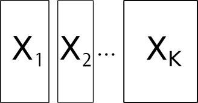
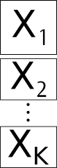
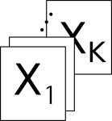

```{r setup, include=FALSE}
options(htmltools.dir.version = FALSE, width = 72)
knitr::opts_chunk$set(tidy=TRUE, tidy.opts=list(width.cutoff=50), fig.height= 4, fig.width=4, dev='svg', fig.align="center", fig.path = "fig/")
```

```{r xaringan-themer, include=FALSE}
library(xaringanthemer)
duo(primary_color = "#1F4257", secondary_color = "#F97B64")
```

```{r include = FALSE}
library(knitr)
hook_output <- knit_hooks$get("output")
knit_hooks$set(output = function(x, options) {
  lines <- options$output.lines
  if (is.null(lines)) {
    return(hook_output(x, options))  # pass to default hook
  }
  x <- unlist(strsplit(x, "\n"))
  more <- "..."
  if (length(lines)==1) {        # first n lines
    if (length(x) > lines) {
      # truncate the output, but add ....
      x <- c(head(x, lines), more)
    }
  } else {
    x <- c(more, x[lines], more)
  }
  # paste these lines together
  x <- paste(c(x, ""), collapse = "\n")
  hook_output(x, options)
})
``` 
$$\newcommand{\tr}{\hspace{-0.05cm}^{\top}\hspace{-0.05cm}} % transpose d'une matrice$$

$$\newcommand{\mb}[1]{\mathbf{#1}}$$

$$\newcommand{\sqnorm}[2]{
 \left \|  #1  \right \|^2_{#2}
}$$

$$\newcommand{\norm}[2]{
 \left \| #1 \right \|_{#2}
}$$


---

# Data structure

.column-left[
.center[

]
]
.column-center[
.center[

]
]
.column-right[
.center[

]
]

* K-tables are stored in objects of class ktab. It is a list of dataframes that share the same row names
* If the common dimension of the tables is the columns, they must be transposed
---

## The `ktab` class

It is a list of data frames with the additional components:

* `lw`: row weights, common to all the tables (vector)
* `cw`: column weights (vector)
* `blo`: number of columns of each table (vector)
* `TL`: index for rows (data frame containing table names and row names)
* `TC`: index for columns (data frame containing table names and column
names)
* `T4`: index for 4 elements of an array (data frame containing table names
and an index varying from 1 to 4), mainly for internal use
* `call`: function call

---

## Building a `ktab`

Four alternative can be used to build a `ktab` object from different types of arguments:

* `ktab.list.df`: a list of data frames with the same rows
* `ktab.list.dudi`: a list of `dudi` objects with the same rows
* `ktab.within`: an object created by a `wca` analysis
* `ktab.data.frame`: a data frame that should be splitted by columns and a vector indicating the number of columns in each table

---

## Managing `ktab` objects

* `c`: concatenates several ktab objects 
* `[`: selects row, column or tables in a ktab
* `t`: transposes all the tables of a ktab (tables must have the same column names and weights)
* `is.ktab`: test if an object is of the class ktab
* `row.names`: returns or modifies the vector of row names shared by all the tables
* `col.names`: returns or modifies the vector of column names
* `tab.names`: returns or modifies the vector of table names
* `ktab.util.names`: automatically builds unique row, column and tab name

---

# Available methods

Various methods are implemented in `ade4`:

* `sepan`: separate analysis

* `pta`: partial triadic analysis

* `foucart`: Foucart analysis

* `mfa`: multiple factor analysis

* `mcoa`: multiple coinertia analysis

* `statis`: STATIS analysis

---
## Separate Analyses

After building the `ktab` object, separate analyses can be performed

```{r, message = FALSE}
library(ade4)
library(adegraphics)
data(friday87)
df <- data.frame(scalewt(friday87$fau, scale = FALSE))
kta <- ktab.data.frame(df, friday87$fau.blo,
    tabnames = friday87$tab.names)
sepan_fri <- sepan(kta) #<<
```

---

### Display the results

```{r}
kplot(sepan_fri)
```

---

## STATIS

To study the common structure, STATIS can be used. The three steps of the analysis are performed by the `statis` function 

```{r, message = FALSE}
statis_fri <- statis(kta, scannf = FALSE) #<<
```


---

### Display the results

```{r}
g1 <- plot(statis_fri)
names(g1)
```

---

### The interstructure

```{r}
g1$inter
```

Eigenvectors and eigenvalues of the matrix of RV coefficients (`statis_fri$RV.coo` and `statis_fri$RV.eig`)

---

### The compromise

```{r}
g1$row
```
 
The coordinates of individuals of the compromise are given by $\mb{L}=\mb{WDU}\mb{\Lambda}^{\frac{1}{2}}$  (`statis_fri$C.li`)
---

### The intrastructure

```{r, echo = TRUE}
kplot(statis_fri, psub.cex = 1.5)
```

Variables of each table $\mb{X}_k$ are represented by the scores $\mb{C}_k= \mb{X}_k\tr \mb{DU}$ (`statis_fri$C.Co`)

---

### Your Turn

1. Create a Rmd or a R file
2. Load one data set from `ade4` that is presented in the course
4. Create an object of the class `ktab` with appropriate function
5. Perform separate analyses
6. Use STATIS to study simultaneously all the tables
7. Interpret
